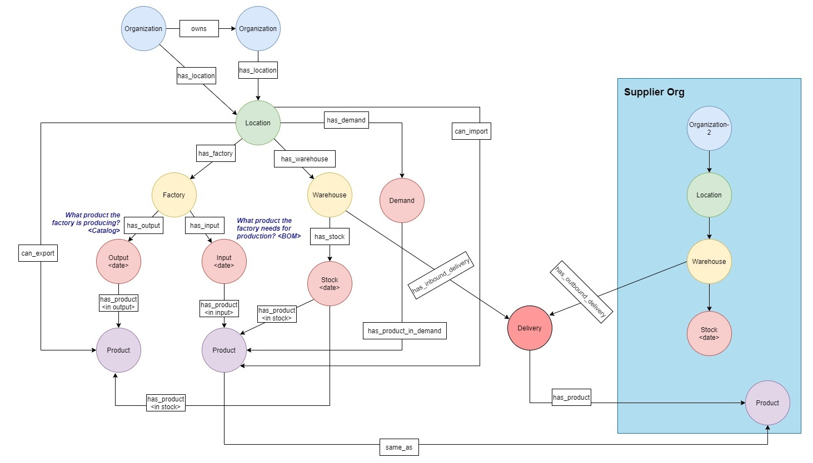
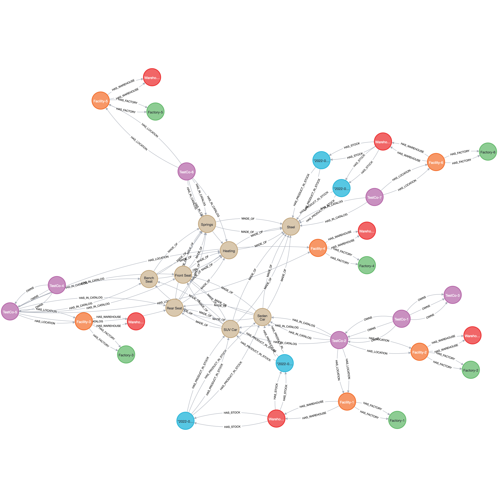

# Supply chain data analysis and visualization using Graph Database (Neo4j).

## Introduction

Global corporations rely on intricate supply chain management, facing disruptions every few years, causing potential substantial earnings loss. Complete supply chain visibility is crucial for control, bottleneck identification, and understanding suppliers. While traditional databases struggle with complex queries, graph databases excel in visualizing interconnected data, enhancing comprehension of relationships.

This guide demonstrates leveraging a graph database, like Neo4j, to visualize supply chain interrelationships where users can explore and identify direct and indirect links between products, components, or suppliers.

## Overview of solution

For this project, we consider a fictitious automotive manufacturing company that builds various car types and models. We go through how to visualize and analyze the supply chain for this company for various use cases using Graphs (Neo4j) using the Cypher query language.

The following diagram provides a high-level overview of how the various components of this fictitious car manufacturing company are related to each other. This provides an overview how the supplier organization and subsidiaries are related with the company, the locations where the factories and warehouses are operating, the various products required to build the car, and how they’re related to demand.

## Data model

Generally, a car manufacturing company might have the following different data types:

- Organizational data containing documentation, processes, facilities, hierarchies, systems and databases, and more
- Product data containing product details or bill of materials (BoM)
- Customer data containing CRM, corporate data, and so on
- Third-party data like dealer data, social media, and market data
- Event data like telematics data, customer connect, or warranty information
- Supply chain data like supplier data, inventory data, or logistics data
For this project, we use data related to inventory, BoM, facilities, and hierarchies.

## Prerequisites

- Docker Desktop
- Python 3.9 or higher
- Knowledge of Cypher and Jupyter notebooks.

## Create the database

In this section, we create the fictitious data required for analysis.

- Seven companies with names as TestCo-*.
- Various facilities, warehouses, and factories required for the analysis.
- We consider various types of cars like sedans and roadsters, and various components of the car like the front seat, rear seat, heating, springs, steel, and more.

Code for creating the database is available in the [create_database.ipynb](create_database.ipynb) notebook.

Followed steps:
1. Create the various companies, suppliers, and subsidiaries
2. Add the locations, warehouses, factories, products, and stock information
3. Verify the number of companies created (it should be seven)
4. Verify the total number of products created (it should be eight)
5. Add the company ownership structure (Moved to data-analysis notebook)
6. Create relationships between factories, warehouses, products, and stock (Moved to data-analysis notebook)

## Visualize the overall graph

## Data analysis

In this section, we traverse the supply chain graph for the fictitious automotive company created in the preceding sections and start to get some actionable KPIs. We’re interested in the following:

- The bill of materials (BOM) for a car
- The various components the car is made of
- The stock for a certain car type in all the warehouses

## Usage

1. Clone the repository
2. Run `docker-compose up` to start the Neo4j database
Neo4j will be available at http://localhost:7474
3. Run `pip install -r requirements.txt` to install the required Python packages
4. Run `jupyter notebook` to start the Jupyter notebook server

## References
Neo4j: https://neo4j.com/
Cypher: https://neo4j.com/developer/cypher/